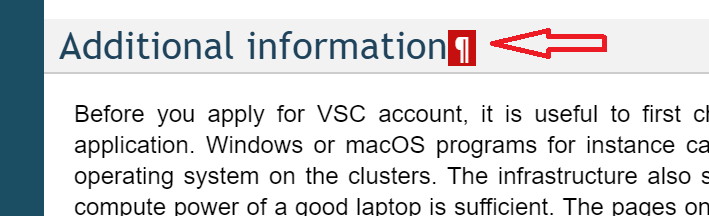

# VscDocumentation

This repository contains user-level documentation for the KU Leuven iRODS infrastructure (ManGO). It is a copy of the original VscDocumentation. Pages are rendered using the KU Leuven huisstijl.

## Prerequisites

You will need to clone the repository, i.e.,
```bash
$ git clone git@gitea.icts.kuleuven.be:u0155170/KULiRODSDocumentation.git
$ cd KULiRODSDocumentation
```

Your life will be substantially easier if you can preview your changes locally.  A conda environment has be defined to install all the required software

Downloads and installation instructions for Miniconda can be found on [conda's website](https://docs.conda.io/en/latest/miniconda.html).

The YAML environment description file is [``sphinx.yml``](sphinx.yml).  The environment can be created using
```bash
$ conda env create -f environment.yml
```

## Workflow

### Activate the environment

The ``sphinx`` environment can be activated by
```bash
$ source activate sphinx
```

### Running a local sphinx server

The repository contains a make file that has a target to run the sphinx server.  The latter will monitor the ``source`` directory for changes, and serve the documentation to a web browser that is opened automatically.
```bash
$ make web
```


### Edit content

You can now edit the content to your heart's content, making commits to your feature branch as you go.  You can push your feature branch to the Github repository whenever you like.
```bash
$ git push origin feature/new_stuff
```


### Pull request

When you are done, create a pull request on GitHub.  For consistency, do the pull request to the development branch, not the master branch.

For major changes, it is good practice to ask others to review your pull request.  Although this policy is encouraged, it is not enforced.

Once the pull request has been merged, the branch will be deleted from GitHub.  For your own convenience, it is probably easiest to pull the master and development branches from GitHub,
and remove the local feature branch, e.g.,
```bash
$ git checkout master
$ git pull
$ git checkout development
$ git pull origin development
$ git branch -d feature/new_stuff
```


## Repository structure

1. source: directory containing the source to be rendered into HTML (e.g., rST and PNG files).
1. images: directory containing source documents for images (e.g., ODG files).
1. Makefile & make.bat: make files to render the documentation, and run a local web server.
1. sphinx.yml: conda environment definition.

The other files and directories are part of the migration, and may be removed at some
later stage.


## Documentation usage

Note that ReadTheDocs has a very convenient feature.  It lets you copy an URL
to a (sub)section of the documentation to make it easy to refer via email.  Simply
copy the link represented by the paragraph icon that appears next to the (sub)section
 title when you hover near it.


